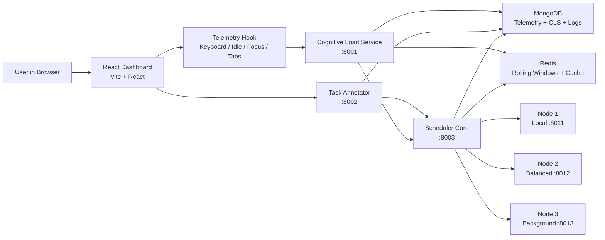
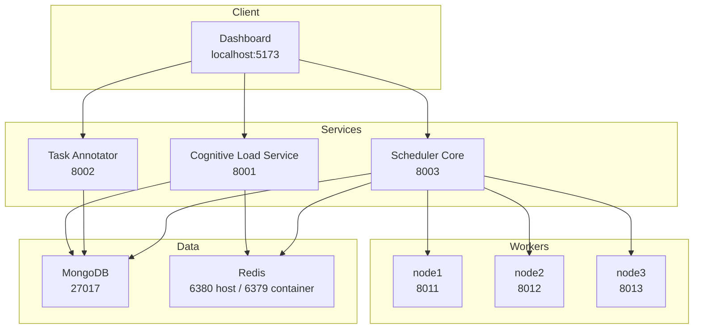
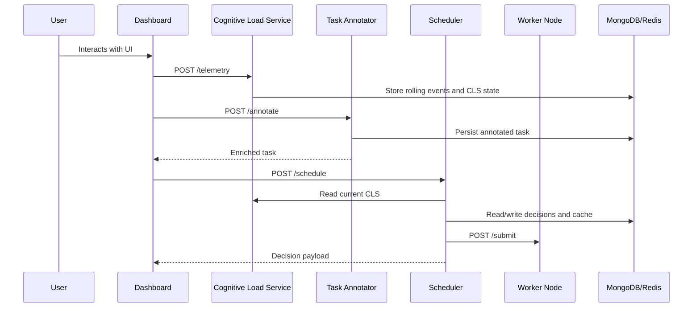
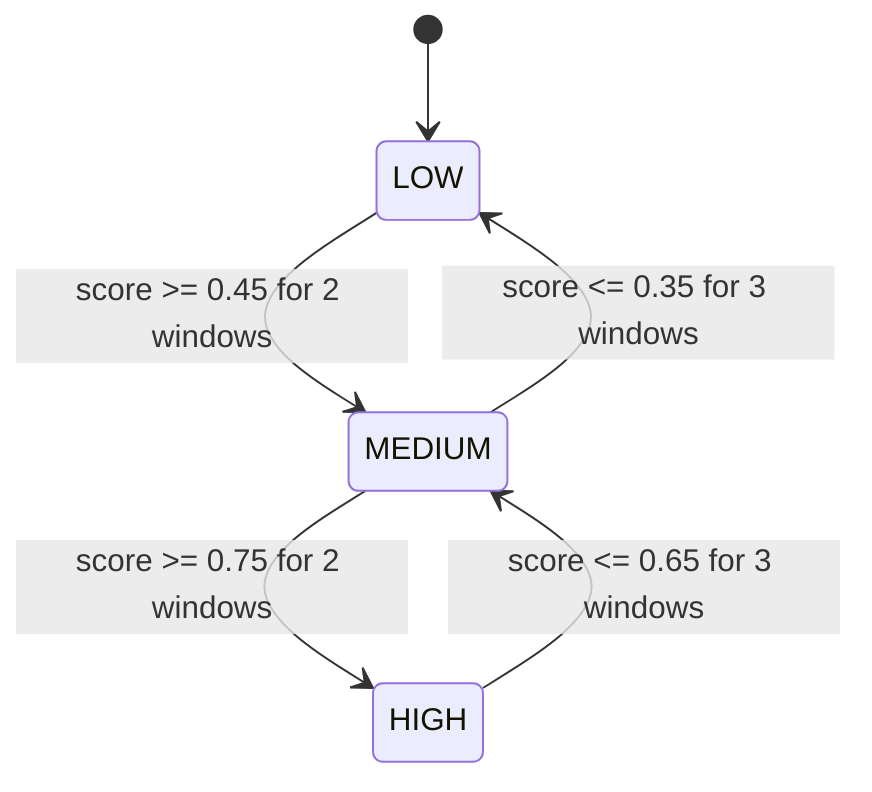
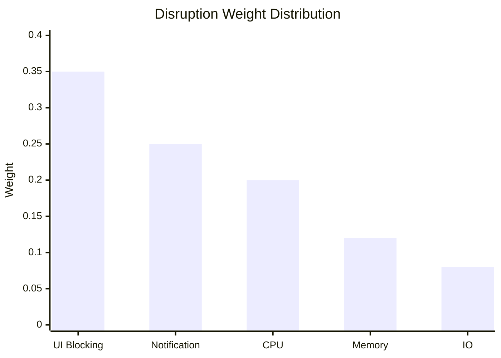
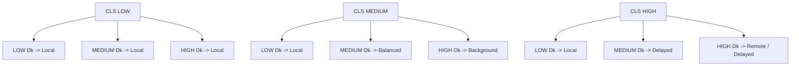
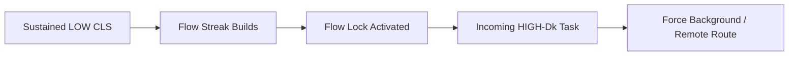
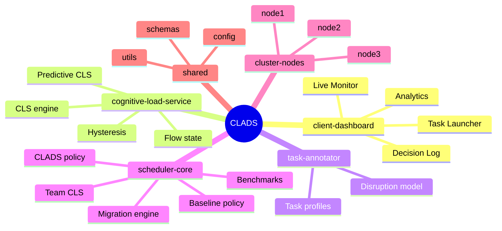
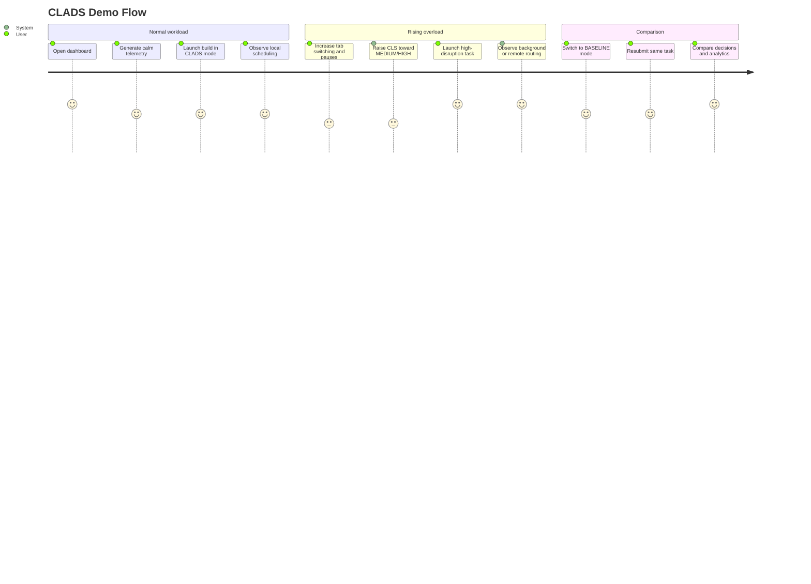

# CLADS

<div align="center">

## Cognitive Load-Aware Distributed Task Scheduler

**A human-aware distributed scheduling prototype that routes work using both machine state and user cognitive state.**


</div>

---

## Why This Project Exists

Traditional schedulers optimize for infrastructure. CLADS optimizes for the **human + machine system**.

Instead of deciding only from CPU, memory, latency, and queue depth, CLADS estimates a live **Cognitive Load Score (CLS)** from browser interaction signals and uses it as a first-class scheduling input. The result is a prototype scheduler that can:

- keep disruptive work away from overloaded users
- preserve focused work sessions with flow-state protection
- compare human-aware scheduling against a baseline scheduler
- collect evidence through decision logs, benchmark summaries, and analytics

---

## At a Glance

| Capability | What CLADS Does |
|---|---|
| Cognitive telemetry | Computes CLS from typing variance, idle time, tab switches, context switches, and focus changes |
| Disruption modeling | Scores task disruptiveness using perceptual-first weighting |
| Scheduling | Chooses local, balanced, background, delayed, or remote execution paths |
| Prediction | Estimates likely rise to `HIGH` CLS before it fully happens |
| Protection | Applies flow-state lock for sustained focused work |
| Analytics | Exposes live metrics, decisions, benchmark summaries, and comparison views |

---

## System Architecture



### Runtime Map



### Runtime Services

| Service | Port | Purpose |
|---|---:|---|
| `clads-mongodb` | `27017` | Persistent storage for telemetry, decisions, tasks, and logs |
| `clads-redis` | `6380 -> 6379` | Rolling telemetry window, CLS cache, and transient state |
| `clads-cognitive-load` | `8001` | CLS computation, hysteresis, prediction, flow-state, governor directives |
| `clads-task-annotator` | `8002` | Task enrichment and disruption modeling |
| `clads-scheduler` | `8003` | Policy engine, node scoring, migration, benchmarks, analytics |
| `clads-node1` | `8011` | Local low-latency worker |
| `clads-node2` | `8012` | Balanced worker |
| `clads-node3` | `8013` | Background worker |
| `client-dashboard` | `5173` | Local dashboard during development |

---

## End-to-End Flow



---

## Core Decision Model

### 1. Cognitive Load Score

CLADS derives a **Cognitive Load Score (CLS)** from interaction-only telemetry:

```text
CLS = α1·idle_time
    + α2·typing_variance
    + α3·tab_switch_rate
    + α4·context_switch_rate
    + α5·focus_change_count
```

### CLS weights

| Feature | Weight |
|---|---:|
| `idle_time` | `0.25` |
| `typing_variance` | `0.25` |
| `tab_switch_rate` | `0.20` |
| `context_switch_rate` | `0.20` |
| `focus_change_count` | `0.10` |

### CLS state stabilization



Hysteresis prevents CLS from flickering between states on short-lived spikes.

---

### 2. Disruption Score

Each task is enriched with a disruption score:

```text
Dk = β1·ui_blocking
   + β2·notification
   + β3·cpu
   + β4·memory
   + β5·io
```

### Disruption weights

| Factor | Weight |
|---|---:|
| `ui_blocking` | `0.35` |
| `notification` | `0.25` |
| `cpu` | `0.20` |
| `memory` | `0.12` |
| `io` | `0.08` |

### Human-first weighting



Perceptual cost dominates hardware cost by design:

- perceptual sum = `0.60`
- hardware sum = `0.40`

### Disruption classes

| Score Range | Class |
|---|---|
| `0.00 - 0.33` | `LOW` |
| `0.34 - 0.66` | `MEDIUM` |
| `0.67 - 1.00` | `HIGH` |

---

### 3. Scheduler Node Score

The scheduler evaluates candidate nodes using:

```text
NodeScore(n) =
  w1·cpu_availability
  + w2·mem_availability
  + w3·latency_preference
  - w4·disruption_penalty
  - w5·queue_penalty
  - sla_penalty
  - arbitration_penalty
```

### Scheduler weights

| Signal | Weight |
|---|---:|
| CPU availability | `0.30` |
| Memory availability | `0.25` |
| Latency | `0.25` |
| Disruption penalty | `0.15` |
| Queue penalty | `0.05` |

### CLADS policy grid



### Policy table

| CLS State | Disruption LOW | Disruption MEDIUM | Disruption HIGH |
|---|---|---|---|
| `LOW` | Local | Local | Local |
| `MEDIUM` | Local | Balanced | Background |
| `HIGH` | Local | Delayed | Remote / Delayed |

---

## Fancy Feature Set

### Predictive CLS

The cognitive load service maintains a rolling CLS history and exposes:

- `predicted_cls`
- `probability_high`
- `trend_slope`
- `estimated_breach_seconds`

This allows the scheduler to react before the user fully enters the `HIGH` state.

### Flow-state lock

If a user sustains low-load interaction for long enough, CLADS can enable a protected flow window. For `HIGH` disruption tasks, that lock can override normal node scoring and force background placement.

Default configuration:

- `FLOW_STATE_THRESHOLD = 180`
- `WINDOW_UPDATE_INTERVAL = 5`
- effective protected window is about **15 minutes**



### CPU governor directives

The CLS engine can emit state-specific CPU governor directives:

| CLS State | Foreground Policy | Background Policy |
|---|---|---|
| `LOW` | `performance` | `performance` |
| `MEDIUM` | `ondemand` | `conservative` |
| `HIGH` | `performance` | `powersave` |

### Adaptive weight calibration

The scheduler records outcomes, accumulates user-specific evidence, and can calibrate decision weights over time.

### Team CLS aggregation

The scheduler also supports cluster-wide arbitration using a weighted aggregate of multiple users' CLS states instead of a single-user perspective.

### Latency benchmarking

The stack records foreground scheduling latency and provides a benchmark summary endpoint for `CLADS` versus `BASELINE`.

---

## Supported Task Types

| Task Type | Category | Typical Use |
|---|---|---|
| `build` | `HIGH` | CPU-heavy project build |
| `deploy` | `HIGH` | Deployment and restart workflows |
| `dependency_install` | `HIGH` | Dependency resolution and package extraction |
| `test_run` | `MEDIUM` | Test execution |
| `ai_request` | `MEDIUM` | Interactive AI workload |
| `static_analysis` | `MEDIUM` | Parsing and analysis workload |
| `lint` | `LOW` | Quick lint pass |
| `indexing` | `LOW` | Background indexing |
| `autosave` | `LOW` | Lightweight save task |

Unknown task types are still accepted through the annotator with a default medium profile.

---

## Repository Layout



### Top-level directories

| Path | Responsibility |
|---|---|
| `client-dashboard/` | React dashboard and telemetry-driven UI |
| `cognitive-load-service/` | CLS engine, predictive logic, flow-state, governor directives |
| `task-annotator/` | Disruption model and task enrichment |
| `scheduler-core/` | CLADS scheduler, baseline scheduler, migration, benchmarks |
| `cluster-nodes/` | Generic simulated worker service for all nodes |
| `shared/` | Shared defaults and configuration |

---

## Quick Start

### Prerequisites

- Docker Desktop with Compose v2
- Node.js `20+`
- Python `3.11+` recommended for helper scripts

### Start the full backend stack

```bash
docker compose up --build
```

### Start the dashboard

```bash
cd client-dashboard
npm install
npm run dev
```

Open:

```text
http://localhost:5173
```

---

## Local Endpoints

### Frontend

- Dashboard: `http://localhost:5173`

### APIs

- Cognitive Load Service: `http://localhost:8001`
- Task Annotator: `http://localhost:8002`
- Scheduler Core: `http://localhost:8003`

### Workers

- Node 1: `http://localhost:8011`
- Node 2: `http://localhost:8012`
- Node 3: `http://localhost:8013`

### Datastores

- MongoDB: `mongodb://localhost:27017`
- Redis host mapping: `localhost:6380`

Inside Docker, Redis remains `redis:6379`.

---

## API Surface

### Cognitive Load Service `:8001`

| Endpoint | Purpose |
|---|---|
| `POST /telemetry` | Ingest telemetry and recompute CLS |
| `GET /cls/{user_id}` | Read current CLS state and prediction payload |
| `GET /cls-history/{user_id}` | Read recent CLS history |
| `GET /governor/{user_id}` | Inspect user governor policy |
| `GET /governor/log` | Inspect governor directive log |
| `PUT /flow-config` | Update runtime flow threshold |
| `GET /flow-state/{user_id}` | Read flow-state lock info |
| `DELETE /cls/{user_id}/reset` | Reset user CLS and rolling state |
| `GET /health` | Health probe |

Example telemetry payload:

```json
{
  "user_id": "u_shagun",
  "keystrokes": 24,
  "avg_inter_key_interval": 54.0,
  "typing_variance": 180.0,
  "idle_duration": 2.0,
  "tab_switches": 1,
  "focus_changes": 1,
  "context_switches": 1
}
```

### Task Annotator `:8002`

| Endpoint | Purpose |
|---|---|
| `POST /annotate` | Enrich a task with profile and disruption metadata |
| `GET /profiles` | Return all task profile definitions |
| `GET /disruption-model/info` | Return disruption weights and hierarchy data |
| `GET /health` | Health probe |

Example annotation payload:

```json
{
  "user_id": "u_shagun",
  "task_type": "build",
  "scheduler_mode": "CLADS"
}
```

### Scheduler Core `:8003`

| Endpoint | Purpose |
|---|---|
| `POST /schedule` | Run CLADS or BASELINE scheduling |
| `GET /decisions` | Read recent decision records |
| `GET /decisions/stats` | Read aggregate chart data |
| `GET /preemptive-migrations` | Read preemptive migration history |
| `GET /weight-profiles` | List adaptive weight profiles |
| `GET /weight-profiles/{user_id}` | Read one user profile |
| `GET /benchmarks/summary` | Read latency benchmark summary |
| `GET /team-cls` | Read aggregate cluster CLS |
| `GET /nodes/metrics` | Read live worker metrics |
| `GET /health` | Health probe |

Example scheduling payload:

```json
{
  "task": {
    "task_id": "task-001",
    "user_id": "u_shagun",
    "task_type": "build",
    "disruption_class": "HIGH",
    "disruption_score": 0.95,
    "latency_sla_ms": 10000,
    "execution_time_ms": 8000
  },
  "scheduler_mode": "CLADS"
}
```

### Worker Node APIs `:8011`, `:8012`, `:8013`

| Endpoint | Purpose |
|---|---|
| `POST /submit` | Queue a task |
| `POST /migrate` | Accept migrated work |
| `GET /metrics` | Return live worker metrics |
| `GET /health` | Health probe |

---

## Demo Storyboard



### Expected behavior

- `LOW` CLS keeps most work local.
- `MEDIUM` CLS shifts disruptive work toward balanced or background nodes.
- `HIGH` CLS pushes disruptive work away from the user through delayed or remote placement.
- `BASELINE` ignores cognitive load and uses infrastructure-only scoring.

---

## Benchmarking

The repository includes:

- `run_tests.py` for synthetic load generation
- `benchmark_results.json` as a sample output artifact

The helper script:

1. sends telemetry that pushes users from lower to higher CLS bands
2. schedules comparable workloads in `CLADS` and `BASELINE`
3. waits for asynchronous evaluation work
4. fetches benchmark and migration summaries
5. writes results to `benchmark_results.json`

Run it after the stack is up:

```bash
python run_tests.py
```

Current checked-in benchmark output includes latency breakdowns, but the headline `HIGH CLS x HIGH Dk` summary is still incomplete in the sample artifact.

---

## Technology Stack

### Frontend

- React `18`
- Vite `5`
- React Router `6`
- Chart.js `4`
- Axios

### Backend

- FastAPI
- Pydantic v2
- MongoDB with Motor
- Redis asyncio client
- HTTPX
- NumPy in the CLS service

### Important runtime knobs

- `REDIS_URL`
- `MONGODB_URI`
- `COGNITIVE_LOAD_URL`
- `FLOW_STATE_THRESHOLD`
- `REAL_GOVERNOR`
- `PREEMPTIVE_MIGRATION_PROB_THRESHOLD`
- `ADAPTIVE_WEIGHT_LEARNING_RATE`

---

## Patent-Oriented Concepts Reflected in Code

| Claim Theme | Implementation Present |
|---|---|
| Interaction-only cognitive estimation | Yes |
| CLS-aware CPU governor directives | Yes |
| Hysteresis-stabilized state transitions | Yes |
| Predictive migration | Yes |
| Flow-state override | Yes |
| Adaptive per-user weight calibration | Yes |
| Team-level aggregate CLS arbitration | Yes |

---

## Current Constraints

- Worker nodes simulate execution rather than running real production tasks.
- Worker CPU and memory metrics are synthetic but consistent for experiments.
- The dashboard currently uses a single demo user: `u_shagun`.
- The checked-in benchmark artifact is useful, but not complete for every headline metric.
- The system is a research/demo prototype rather than a production-hardened platform.

---

## Next Improvements

- add formal end-to-end tests for all services
- persist richer CLS history instead of mostly current-state views
- support multiple users in the dashboard
- add auth and data isolation
- replace simulated workers with real task adapters
- generate benchmark and evidence reports automatically

---

## License

This repository does not currently expose an explicit license file. If you intend to publish, distribute, or open-source it, add a license and any academic or IP attribution required for your use case.
